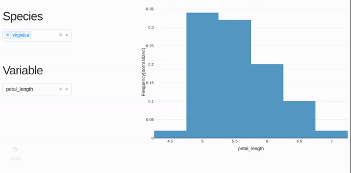

# What is it?



It's an interactive application written using Dash (a.k.a shiny for python). This application demonstrates how easily you can build interactive visualizations in pure Python. I have used the classic iris dataset in this project.

**No HTML/CSS/JS required.** Although you could choose to add CSS and write your custom React/JS components.

# How to install?

```
pip install -r requirements.txt
```

# How to run?

```
python app.py 8000 #change 8000 to any port you want

or

python app.py #runs on port 80 by default
```

# How to deploy it to Heroku?

Make sure that you have a Heroku account. Then, follow the steps in <https://plot.ly/dash/deployment>

or keep reading..

This app is deployment ready.

- **update requirements.txt before pushing to heroku**

  ```
    pip freeze > requirments.txt
  ```

- First time set-up:

  ```
    $ heroku create UNIQUE-APP-NAME # 1\. change my-dash-app to a unique name
    $ git add . # 2\. add all files to git
    $ git commit -m 'Initial app boilerplate' # 3\. commit your changes
    $ git push heroku master # 4\. deploy code to heroku
    heroku ps:scale web=1  # 5\. run the app with a 1 heroku "dyno"
    $ heroku config:set SECRET_KEY=my_secret_key # 6\. replace my_secret_key with a random string
  ```

- You're all set! It should be up and running at _<https://[UNIQUE-APP-NAME].herokuapp.com>_ . Once you make any modifications, follow steps 2-4 above.

- To check if your service is up and running do:

  ```
        $ heroku ps
  ```

- To check for errors:

  ```
        $ heroku logs
  ```
